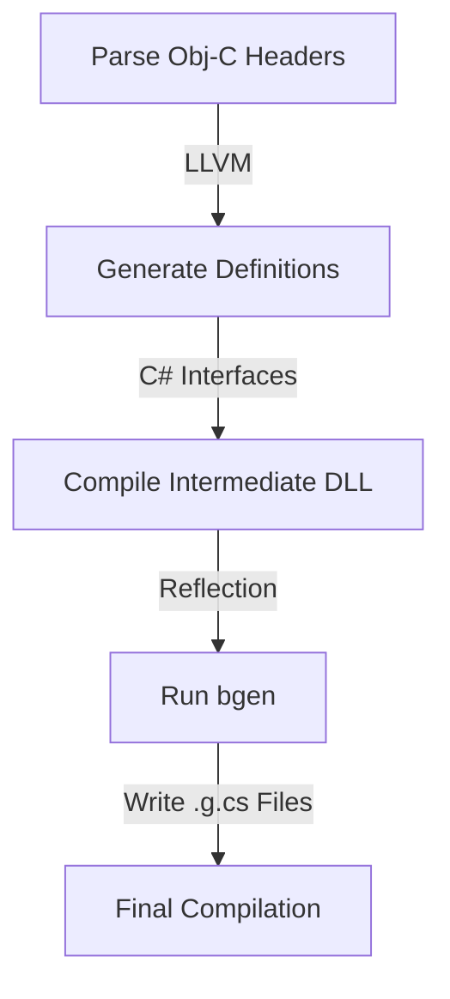

# Creating a Domain Specific Language with Roslyn

I left Microsoft three months ago. During that time, I realized that very few people—both inside and outside the
company—understood what the long-term goals of the Microsoft.iOS and Microsoft.MacOS projects actually were.

This post is the first in a series where I’ll explain how, while working on Microsoft.iOS, I came to see iOS bindings 
not as a code-generation problem, but as a language design problem. More specifically, how we used Roslyn to turn 
binding definitions into a Domain Specific Language (DSL)—with real syntax, real semantics, and compile-time guarantees.

This series uses Microsoft.iOS as a concrete example, but the ideas apply to anyone building SDKs, bindings, 
or large code-generated APIs.

## What is a Domain Specific Language?

A [Domain Specific Language](https://en.wikipedia.org/wiki/Domain-specific_language) is a programming language designed
to solve a specific problem, in contrast to a general-purpose language like C#.

This idea is closely related to [language-oriented programming](https://en.wikipedia.org/wiki/Language-oriented_programming): 
instead of forcing a general language to model a domain, you design language constructs that reflect the domain itself.

### So what does that mean for iOS?

The goal of Xamarin.iOS, and later Microsoft.iOS, was to fully expose Objective-C APIs to C# developers. To do that 
correctly, we needed more than wrappers. We needed a way to describe Objective-C APIs in C#, while preserving:

- ABI details
- Memory semantics
- Platform availability
- Objective-C–specific constraints that don’t exist in C#

In other words, we needed a DSL that defines the contract between Objective-C and C#.

## What is Roslyn?

Roslyn is a compiler framework that allows you to write code that can be used to generate code. The way I view Roslyn is
a set of APIs that allows me to be part of the compiler pipeline, and that way modify its behavior to match that one
of the domain I am interested in. I am going to oversimplify how Roslyn works and focus on the parts that are relevant
to our goal, but if you are interested in learning more about Roslyn I recommend reading the 
[Roslyn documentation](https://github.com/dotnet/roslyn/blob/384ccc39a5733c54fc6dd2542575d57dc32e7586/docs/features/incremental-generators.md).

For our project we are going to use the three extension points that Roslyn provides:

- Roslyn code generators (incremental generators)
- Roslyn analyzers (syntax and semantic analyzers)
- Roslyn code fix providers (quick fixes)

The above list provides enough entry points to create a Domain Specific Language for iOS bindings and probably more. Let's
focus on what we are planning to do with each of these entry points.

## Roslyn code generators (incremental generators)

Bindings are very repetitive, most of the code looks the same, and they can be easily automated. Most of the work of 
a binding is to work around the impedance mismatch between Objective-C and C#. That is, the Objective-C APIs are not 
as expressive as C# and the C# APIs are not as expressive as Objective-C and we need to work around that. 

If you open any of the generated bindings from the Microsoft.iOS project you will notice that they are very repetitive.
The majority of the code is the same, and looks like this:

```csharp
[SupportedOSPlatform ("macos")]
[SupportedOSPlatform ("ios")]
[SupportedOSPlatform ("tvos")]
[SupportedOSPlatform ("maccatalyst13.1")]
[BindingImpl (BindingImplOptions.GeneratedCode | BindingImplOptions.Optimizable)]
public static partial global::Foundation.NSCharacterSet Alphanumerics
{
    [SupportedOSPlatform ("macos")]
    [SupportedOSPlatform ("ios")]
    [SupportedOSPlatform ("tvos")]
    [SupportedOSPlatform ("maccatalyst13.1")]
    [Export ("alphanumericCharacterSet")]
    get
    {
        global::Foundation.NSCharacterSet ret;
        if (IsDirectBinding) {
            ret = global::ObjCRuntime.Runtime.GetNSObject<global::Foundation.NSCharacterSet> (global::ObjCRuntime.Messaging.NativeHandle_objc_msgSend (this.Handle, global::ObjCRuntime.Selector.GetHandle ("alphanumericCharacterSet")))!;
        } else {
            ret = global::ObjCRuntime.Runtime.GetNSObject<global::Foundation.NSCharacterSet> (global::ObjCRuntime.Messaging.NativeHandle_objc_msgSendSuper (this.SuperHandle, global::ObjCRuntime.Selector.GetHandle ("alphanumericCharacterSet")))!;
        }
        global::System.GC.KeepAlive (this);
        MarkDirty ();
        __mt_Alphanumerics_var_static = ret;
        return ret;
    }

    [SupportedOSPlatform ("macos")]
    [SupportedOSPlatform ("ios")]
    [SupportedOSPlatform ("tvos")]
    [SupportedOSPlatform ("maccatalyst13.1")]
    [Export ("setAlphanumericCharacterSet:")]
    set
    {
        var value__handle__ = value!.GetNonNullHandle (nameof (value));
        if (IsDirectBinding) {
            global::ObjCRuntime.Messaging.void_objc_msgSend_NativeHandle (this.Handle, global::ObjCRuntime.Selector.GetHandle ("setAlphanumericCharacterSet:"), value__handle__);
        } else {
            global::ObjCRuntime.Messaging.void_objc_msgSendSuper_NativeHandle (this.SuperHandle, global::ObjCRuntime.Selector.GetHandle ("setAlphanumericCharacterSet:"), value__handle__);
        }
        global::System.GC.KeepAlive (this);
        global::System.GC.KeepAlive (value);
        MarkDirty ();
        __mt_Alphanumerics_var_static = value;
    }
}
```

The above code is generated for every Objective-C API exposed in the bindings. The example above is for the 
`alphanumericCharacterSet` property, and most of the code focuses on converting C# types to Objective-C types and vice
versa. It also makes sure that the memory management is correct, as Objective-C APIs are reference counted while C# 
APIs are not. Memory could be a post of its own; maybe in the future I could write about it.

### Life Before Roslyn: bgen

Before Roslyn existed, the approach that [Miguel de Icaza](https://en.wikipedia.org/wiki/Miguel_de_Icaza) took was to 
write an application that would generate the bindings for us. In his impressive wisdom, Miguel realized that the best 
way to describe how an API from Objective-C should be exposed in C# was by writing the binding contract itself in C#. 
To do so, the first (and current) binding generator for Xamarin.iOS was born (bgen). To tackle this task without
access to the compiler is very ingenious; the bindings contract would be written as interfaces that the generator would 
load via reflection and generate the bindings based on that. This approach worked well for bgen, especially before the
introduction of nullable annotations in both C# and Objective-C. The process of generating the bindings would follow
this pipeline:


1. *Parse Obj-C Headers:* The process begins by using LLVM to parse the original Objective-C header files to understand 
the native API structure.
2. *Generate Definitions:* Intermediate C# files are generated. These act as a "contract" using interfaces and
attributes to describe how the Objective-C API should be mapped to C#.
3. *Compile Intermediate DLL:* These interface definitions are compiled into a temporary assembly (DLL). This assembly
contains the metadata needed for the next step.
4. *Run bgen:* The generator tool (bgen) loads the intermediate DLL via reflection. It processes the attributes and
interface structures to produce the actual glue code (generated as .g.cs files).
5. *Final Compilation:* The generated source files are combined with any manual "sugar" code or hand-written wrappers
and compiled into the final library.

While the above pipeline is basic, it is still a very powerful tool that can be used to generate bindings for 
Objective-C APIs. Nevertheless, the more we had to bind, the more complex the process became:

1. The process required a lot of manual work. The original bgen tool would generate all the bindings but would not update 
the current ones.
2. Apple would make changes to the Objective-C APIs that would require us to update the bindings, yet we had to maintain backward 
compatibility, meaning we had to write manual code to handle the changes.
3. The process was slow. It took a lot of time to generate the bindings—everybody knows that reflection is slow, and to 
that, we had to add the extra compilation steps.
4. Although the pipeline is simple, when a new symbol had to be introduced into the project, it was complicated to
understand where in the pipeline it had to be added. Should it be added in the first compilation step or in the last one?
5. Using reflection resulted in a lot of complicated code that would copy attributes from the C# contracts to the final
generated code. The most important part of the attributes were those used to describe the platforms supported by the API.
6. Reflection has its limitations; for example, reflection does not see a difference between `Action<string>` and
`Action<string?>`.

### Moving to Roslyn: From API to Language

Moving to Roslyn allowed us to solve all the above problems and make the process much simpler. We moved from several
compilations to a single compilation. What is more, we could use Roslyn to generate the bindings for us as well as 
access the semantic model of Roslyn to make decisions based on the API structure. 

Roslyn generators allowed us to create a more concise API via the use of generic attributes (yes, they exist) for the
contract definitions. For example:

```csharp
[SupportedOSPlatform ("macos")]
[SupportedOSPlatform ("ios")]
[SupportedOSPlatform ("tvos")]
[SupportedOSPlatform ("maccatalyst13.1")]
[BindingType<Class>]
public partial class MyObjCClass {

    [Export<Constructor> ("initWithScheme:host:path:")]
	public ConstructorTests (string scheme, string host, string path);

    [SupportedOSPlatform ("ios")]
	[SupportedOSPlatform ("tvos")]
	[SupportedOSPlatform ("macos")]
	[SupportedOSPlatform ("maccatalyst13.1")]
	[Export<Property> ("count")]
	public virtual partial nuint Count { get; set; }

    [SupportedOSPlatform ("ios")]
	[SupportedOSPlatform ("tvos")]
	[SupportedOSPlatform ("macos")]
	[SupportedOSPlatform ("maccatalyst13.1")]
	[Export<Method> ("valueForKey:", Flags = Method.MarshalNativeExceptions)]
	public virtual unsafe partial NSObject ValueForKey (NSString key);
	
	
}
```

If you look closely, the binding is using the `ExportAttribute` to describe the Objective-C API for constructors, properties, 
and methods. This is invaluable because it allows us to set the `Flags` property definition to match that of the enum passed
to the `ExportAttribute`. What does this mean? Well, it means that we can use a single attribute to describe both 
properties and methods; at the same time, the compiler will know which one it is and will ensure that the flags match.

I defined the export attribute as follows:

```csharp
using System.Reflection;
using System.Diagnostics.CodeAnalysis;
using Registrar;

#nullable enable

namespace ObjCBindings {

	[Experimental ("APL0003")]
	[AttributeUsage (AttributeTargets.Method | AttributeTargets.Constructor | AttributeTargets.Property)]
	public class ExportAttribute<T> : Attribute where T : Enum {

		/// <summary>
		/// Get/Set the selector that is exposed by the decorated method.
		/// </summary >
		public string? Selector { get; set; } = null;

		/// <summary>
		/// Get/Set the export configuration flags.
		/// </summary >
		public T? Flags { get; set; } = default (T);

		/// <summary>
		/// Get/Set the argument semantics to be used with the native method.
		///  </summary >
		public ArgumentSemantic ArgumentSemantic { get; set; } = ArgumentSemantic.None;

		/// <summary>
		/// Get/Set the native prefix to be used in the custom marshal directive.
		///
		/// The generator will only respect this value if the CustomMarshalDirective flag is set.
		/// If the flag is not set the analyzer will raise a compiling error.
		/// </summary >
		public string? NativePrefix { get; set; } = null;

		/// <summary>
		/// Get/Set the native suffix to be used in the custom marshal directive.
		///
		/// The generator will only respect this value if the CustomMarshalDirective flag is set.
		/// If the flag is not set the analyzer will raise a compiling error.
		/// </summary >
		public string? NativeSuffix { get; set; } = null;

		/// <summary>
		/// Get/Set the library to be used in the custom marshal directive.
		///
		/// The generator will only respect this value if the CustomMarshalDirective flag is set.
		/// If the flag is not set the analyzer will raise a compiling error.
		/// </summary >
		public string? Library { get; set; } = null;

		/// <summary>
		/// The type of the result for an async method.
		/// </summary>
		public Type? ResultType { get; set; } = null;

		/// <summary>
		/// The name of the generated async method.
		/// </summary>
		public string? MethodName { get; set; } = null;

		/// <summary>
		/// The name of the type of the result for an async method.
		/// </summary>
		public string? ResultTypeName { get; set; } = null;

		/// <summary>
		/// A code snippet to be executed after the async method call.
		/// </summary>
		public string? PostNonResultSnippet { get; set; } = null;

		/// <summary>
		/// The type of the strong delegate for a weak delegate property.
		/// </summary>
		public Type? StrongDelegateType { get; set; } = null;

		/// <summary>
		/// The name of the strong delegate for a weak delegate property.
		/// </summary>
		public string? StrongDelegateName { get; set; } = null;

		/// <summary>
		/// Get/Set the type of the strong dictionary key class.
		/// </summary>
		public Type? StrongDictionaryKeyClass { get; set; } = null;

		/// <summary>
		/// The type of the event args to use.
		/// </summary>
		public Type? EventArgsType { get; set; } = null;

		/// <summary>
		/// The name of the type of the event args method.
		/// </summary>
		public string? EventArgsTypeName { get; set; } = null;

		protected ExportAttribute () { }

		/// <summary>
		/// Mark a managed method as an exported selector.
		/// </summary >
		/// <param name="selector">The native selector to be exported.</param>
		public ExportAttribute (string? selector)
		{
			Selector = selector;
		}

		/// <summary>
		/// Mark a managed method as an exported selector.
		/// </summary >
		/// <param name="selector">The native selector to be exported.</param>
		/// <param name="semantic">The argument semantics to use when calling the native selector.</param>
		public ExportAttribute (string? selector, ArgumentSemantic semantic)
		{
			Selector = selector;
			ArgumentSemantic = semantic;
			Flags = default (T);
		}

		/// <summary>
		/// Mark a managed method as an exported selector.
		/// </summary >
		/// <param name="selector">The native selector to be exported.</param>
		/// <param name="flags">The configuration flags for the managed method.</param>
		public ExportAttribute (string? selector, T? flags)
		{
			Selector = selector;
			ArgumentSemantic = ArgumentSemantic.None;
			Flags = flags;
		}

		/// <summary>
		/// Mark a managed method as an exported selector.
		/// </summary >
		/// <param name="selector">The native selector to be exported.</param>
		/// <param name="semantic">The argument semantics to use when calling the native selector.</param>
		/// <param name="flags">The configuration flags for the managed method.</param>
		public ExportAttribute (string? selector, ArgumentSemantic semantic, T? flags)
		{
			Selector = selector;
			ArgumentSemantic = semantic;
			Flags = flags;
		}
	}
}
```

Any avid reader will notice that the `ExportAttribute` is generic and, not only that, but it exposes properties that do not
make sense in all possible cases. For example, `StrongDelegateType` only makes sense for weak delegate properties, but
not on methods. This is an example where C# as a general-purpose language is not enough to describe the Objective-C APIs.
The language allows us to describe something that the semantics of the API does not allow; we will talk about this in 
the Roslyn analyzers section. That is when we move from a simple API to describe bindings to a DSL that has both
syntax and semantics. For anyone interested, all the attributes are defined in the [ObjCBindings](https://github.com/dotnet/macios/tree/main/src/ObjCBindings) namespace.

[Rgen](https://github.com/dotnet/macios/tree/main/src/rgen/Microsoft.Macios.Generator), in the Microsoft.iOS project,
contains the generator for the bindings. I do want to point out the architecture of the generator:

1. The generator contains a data model type. The reason for that is to ensure that the incremental generator is able 
to be efficient and generate code only when needed. The other use of the data model was to share it between the 
analyzers, the LLVM parser, and the generator.
2. I am one of the few people that use the Roslyn API to generate code. A lot of developers use a `StringBuilder` with 
interpolation to generate code, but that is an error in large code generators. My approach was to create a `SyntaxFactory` 
similar to the one provided by Roslyn that would use tokens. This approach allows writing code such as 
`AssignVariable (GetReturnVariableName (), ConvertToManaged (method, invocation)!);`. This allows doing function 
composition to generate statements. Some devs might notice that I took a very functional programming approach with
readonly structures and function composition.
3. The generator main code uses pattern matching to generate the code. The generator will get the API contract and,
based on the contract definition, use an emitter for the specific contract to generate. That way, unit tests are 
straightforward to write and the generator code is very concise. 

At this point, we have our first step in the process: we can create a contract definition and compile it, but we still
need to ensure that the binding definitions are semantically correct.

## Roslyn analyzers - From “Valid C#” to “Valid Binding”

The analyzer is probably the cornerstone to ensure that we move from a simple API to a DSL that has both syntax and 
semantics. The analyzer will be able to detect errors in the binding contract and report them to the user at compile 
time. This is a crucial step because it will ensure that the bindings are correct and that we do not break the 
API contract as well as the semantics of the Objective-C APIs. Let's look at an example:

```csharp
using System;
using System.Runtime.Versioning;
using AVFoundation;
using CoreGraphics;
using Foundation;
using ObjCBindings;
using ObjCRuntime;
using nfloat = System.Runtime.InteropServices.NFloat;

namespace TestNamespace;

[SupportedOSPlatform ("macos")]
[SupportedOSPlatform ("ios")]
[SupportedOSPlatform ("tvos")]
[SupportedOSPlatform ("maccatalyst13.1")]
[BindingType<Class>]
public partial class TestClass{

	[SupportedOSPlatform ("ios")]
	[SupportedOSPlatform ("tvos")]
	[SupportedOSPlatform ("macos")]
	[SupportedOSPlatform ("maccatalyst13.1")]
	[Export<Property> ("delegate",
		ArgumentSemantic.Weak,
		Flags = Property.WeakDelegate,
		StrongDelegateType = typeof (INSUserActivityDelegate),
		StrongDelegateName = "Delegate"
	)]
	public virtual partial NSObject? OtherWeakDelegate { get; set; }

	[SupportedOSPlatform ("ios")]
	[SupportedOSPlatform ("tvos")]
	[SupportedOSPlatform ("macos")]
	[SupportedOSPlatform ("maccatalyst13.1")]
	[Export<Property> ("delegateSecond",
		ArgumentSemantic.Weak,
		Flags = Property.WeakDelegate,
		StrongDelegateType = typeof (INSUserActivityDelegate),
		StrongDelegateName = "Delegate"
	)]
	public virtual partial NSObject? WeakSecondDelegate { get; set; }
}
```

The above code is valid C#; there is nothing that the compiler would complain about, yet it is an invalid Objective-C 
binding. The issue with the above code is that the weak delegate 'WeakSecondDelegate' strong delegate 'Delegate' 
is already used by 'OtherWeakDelegate'. I cannot stress enough how important this is: we are moving from an API that 
allows us to define the bindings to a DSL in which the binding definitions are semantically correct and the syntax is 
straightforward.

Currently, with the bgen implementation used by the project, the only time errors could be reported was at generation
time, and dealing with the errors was a pain. With Roslyn analyzers, we can report errors at compile time and provide 
the user with a detailed error message as well as a fix suggestion. Not only that, but diagnostic messages 
are clickable on any modern editor and will take the user directly to the line of code that caused the error.

If you look at the Microsoft.iOS project, you will notice that the most complicated code is in the generator, yet the
code that provides the most value is in the analyzers.

## Roslyn code fix providers

The Roslyn code fix providers allow us to complete the full developer experience. If the analyzer reports an error, the
user can click on the error and the code fix provider will be able to provide a fix suggestion. Because we can provide
semantic validations, we also can provide a fix suggestion that will automatically fix the error and correct any
issues that the user might have.

## Conclusion

So far I have introduced the main idea of using Roslyn to generate bindings for Objective-C APIs and move from a simple 
API to a DSL that has both syntax and semantics. In the following posts, I will get into the implementation details of 
the Roslyn generators and analyzers, and how I managed to write a huge amount of unit tests for the generator. I am
sure there are a number of things that will help you understand the Roslyn APIs better as well as writing SDKs that 
use Roslyn to enforce semantic checks at compile time. I will also introduce the full API I was designing for 
the Microsoft.iOS project as well as how the rgen process was going to be exposed to an MCP to get Copilot to automatically
generate the bindings for us from the Objective-C headers.

This post sets the foundation. In the next parts, I’ll go deeper into:

- Part 2: Designing the binding contract as a DSL
- Part 3: Generator architecture and incremental design
- Part 4: Writing analyzers that enforce semantic rules
- Part 5: Code fix providers and developer experience
- Part 6: Testing large Roslyn generators at scale
- Part 7: Exposing the binding pipeline to tools like Copilot
